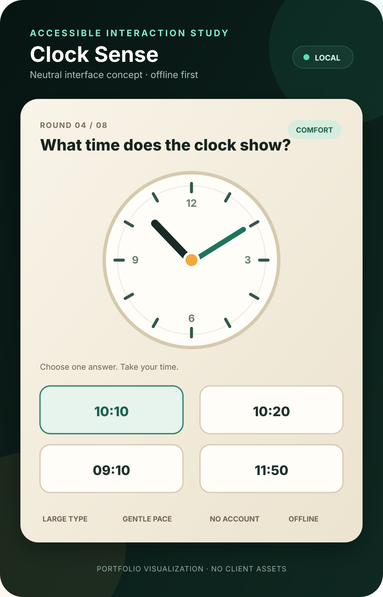

[English](README.md) · [简体中文](README.zh-CN.md)

# Elder-Friendly Offline Games

### 适老离线互动游戏 · 匿名产品工程案例

面向公共服务等候场景中的老年用户，探索易于使用、支持离线运行的跨平台休闲游戏。

`SwiftUI` · `Flutter` · `iOS / iPadOS` · `Android` · `Windows`

  

## 产品问题

怎样让一段短暂的等候时间，变成老年用户能够轻松参与的互动体验，同时无需注册账户、连接网络或学习陌生手势？

原型通过七种休闲小游戏探索这个问题，提供四档难度、大字号、高对比度、宽松的点击区域、可选计时与设备本地语音。

## 产品决策

| 决策 | 原因 |
|---|---|
| 无需账户或登录 | 减少初次使用步骤，避免收集身份信息 |
| 优先支持离线运行 | 无网络时仍可使用核心功能 |
| 不使用摄像头、麦克风或定位 | 减少权限申请与隐私暴露 |
| 大尺寸控件与高对比度 | 降低阅读负担与触控精度要求 |
| 温和的错误反馈 | 避免让玩家感到难堪或被催促 |
| 新玩家进入时重置难度 | 避免继承上一位玩家的设置，造成意外负担 |
| 反馈期间及切入后台时暂停 | 避免将非操作时间计入挑战计时 |

## 原型范围

- 七种小游戏，覆盖记忆、排序、视觉搜索、色词干扰、读钟、分类与空间回忆。
- 四档难度，可选择计时挑战。
- 使用 SwiftUI 实现 iOS / iPadOS 版本。
- 使用 Flutter 共享 Android 与 Windows 版本实现。
- 本地设置，在设备支持时使用离线语音，无云端成绩服务。
- 针对原型支持的平台进行构建、交互与发布检查。

## 工程考量

### 使用会话与多人轮流操作

目标场景可能出现不同用户先后使用同一台设备。因此，新玩家进入时重置难度属于一次使用会话的边界：上一位玩家的选择不应意外提高下一位玩家的任务难度。这个决策将游戏规则与实际使用方式联系起来。

原型也区分实际操作、答案反馈与应用处于后台的时间。展示答案反馈时暂停，给用户阅读或听取反馈的时间；应用切入后台时暂停，避免把中断计为游戏时间。这些属于交互状态的设计，需要和界面样式一起考虑。

### 计时与反馈的关系

可选计时挑战与基础休闲体验承担不同的作用。大尺寸控件和高对比度帮助用户完成操作；温和反馈让用户有机会理解错误并继续尝试。计时规则需要与这些选择一致，因此，答案反馈与非操作时段被纳入暂停边界。

### 本地数据与设备能力

公开原型采用本地设置，不提供云端成绩服务。无需账户意味着不需要围绕身份信息建立初次使用流程；不依赖摄像头、麦克风和定位，减少了核心游戏对系统权限的依赖。语音使用设备本地能力，离线语音是否可用取决于设备支持，不能将它视为所有设备都一致具备的条件。

### 两套界面技术，共同的产品要求

SwiftUI 用于 iOS 和 iPadOS，Flutter 实现 Android 与 Windows 版本。共同的产品要求通过游戏规则、难度级别、控件可读性、反馈与暂停行为来表达。已记录的构建、交互和发布检查覆盖原型支持的目标平台，不能据此宣称兼容所有设备，也不能证明健康效果。

## 使用与隐私边界

这是一个休闲互动原型，不用于诊断疾病、估算认知年龄、对用户进行能力排名，也不宣称能够预防或治疗疾病。使用过程无需提供姓名、电话号码、财务信息或客户记录。

## 公开版本的权利边界

本案例已移除机构名称、标志、海报、员工指引、交付信息、设备标识、授权文件，以及可能暗示机构背书的表述。私有生产材料不包含在这个仓库中。

在权利归属与公开许可得到确认之前，原始项目名称及客户专属视觉标识保持私有。

## 我的贡献

我参与产品定义、无障碍体验决策、游戏规则、多平台实现、测试设计、失败复查与发布验证。AI 工具辅助实现与调试；产品判断与公开主张均依据可运行的构建和本地记录进行核对。

## 权利说明

本仓库原创案例文字与中性展示材料 © 2026 David Deng，保留所有权利。本仓库不授予私有源码、客户专属界面、原始题库、部署文件或授权系统的使用许可。
